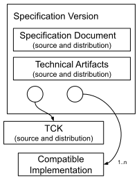
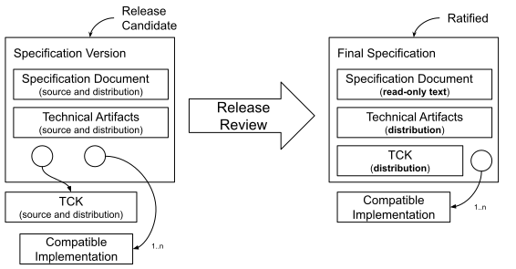

////
 * Copyright (C) Eclipse Foundation, Inc. and others. 
 * 
 * This program and the accompanying materials are made available under the
 * terms of the Eclipse Public License v. 2.0 which is available at
 * http://www.eclipse.org/legal/epl-2.0.
 * 
 * SPDX-License-Identifier: EPL-2.0
////
[[efsp]]
= Eclipse Foundation Specification Process

Version {project-version}. {effectiveDate}

toc::[]

The document describes the Eclipse Foundation Specification Process (EFSP) for optional use by Eclipse Foundation Working Groups.

The EFSP leverages and augments the {edpUrl}[Eclipse Foundation Development Process] (EDP). The EDP defines important concepts, including the Open Source Rules of Engagement, the organizational framework for open source projects and teams, releases, reviews, and more.

Although many of the activities related to this process are conducted by open source projects operating under the EDP, this specification process, and the Specification Versions delivered under it, are to be managed by Working Groups.

Subject to the approval of the Eclipse Management Organization (Executive Director or Delegate), individual Specification Committees may tailor the process for their unique requirements.

This document, and future revisions thereof will be approved by the Eclipse Foundation Board of Directors.

[[efsp-documents]]
== Applicable Documents and Processes

* https://www.eclipse.org/org/documents/eclipse_foundation-bylaws.pdf[Eclipse Foundation Bylaws]
* {ewgpUrl}[Eclipse Foundation Working Group Process]
* The Working Group Participation Agreement for the corresponding Working Group
* https://www.eclipse.org/legal/efsl.php[Eclipse Foundation Specification License]
* https://www.eclipse.org/legal/tck.php[Eclipse Foundation TCK License]
* Eclipse Foundation Trademark License Agreement
* https://www.eclipse.org/org/documents/eclipse_membership_agreement.pdf#[Eclipse Foundation Membership Agreement]
* {edpUrl}[Eclipse Foundation Development Process]
* https://www.eclipse.org/org/documents/Eclipse_IP_Policy.pdf#[Eclipse Foundation Intellectual Property Policy]
* https://www.eclipse.org/org/documents/Eclipse_Antitrust_Policy.pdf#[Eclipse Foundation Anti-Trust Policy]

In the event of any conflict between the terms set forth in this EFSP and the terms of the documents listed above, the terms of those documents shall take precedence.

[[efsp-terms]]
== Terms and Definitions

[glossary]
Brand :: The name and logo selected by the Working Group solely for the use of Compatible Implementations of Specifications designated by a Specification Committee.

Check Point Reviews :: The Plan Review, the Progress Review, and the Release Reviews.

Committer :: A developer who has the necessary rights to make decisions regarding a Project.

Compatible Implementation :: Any implementation that fulfills all requirements of a Final Specification as demonstrated by fulfilling all requirements of the associated TCK.

Contribution :: Content delivered to a Project under the terms of the https://www.eclipse.org/legal/ECA.php#[Eclipse Contributor Agreement].

Contributor :: An individual who is a party to the https://www.eclipse.org/legal/ECA.php[Eclipse Contributor Agreement].

Creation Review :: A review to assess the community and membership response to a Project Proposal, verifies that appropriate resources are available for the project to achieve its plan, and serves as a Committer election for the project's initial Committers. For a complete definition, see the {edpCreationReviewUrl}[EDP].

Final Specification :: A Ratified Specification Version.

Individual Participant :: An individual Committer on a Specification Project.

Major Release :: A type of Release that includes either significant new functionality and/or breaking changes.

Member Participant :: A Strategic or Contributing Member of the Eclipse Foundation (as defined in the {bylawsUrl}[Eclipse Foundation Bylaws]) that has executed the corresponding Working Group Participation Agreement (for more information, see the {ewgpMemberRoles}[Member Roles] and {ewgpAgreements}[Agreements] in the Eclipse Foundation Working Group Process).

Milestone Build :: A build of the project content for limited distribution to demonstrate progress and solicit feedback.

Minor Release :: A type of Release that includes new features over a Major Release.

Open Source License ::
One of the following OSI-approved open source licenses:
+
****
* https://www.eclipse.org/legal/epl-2.0/[Eclipse Public License - v 2.0] (possibly with Secondary Licenses) +
SPDX short identifier: EPL-2.0
* https://www.eclipse.org/org/documents/edl-v10.php[Eclipse Distribution License - v 1.0] +
SPDX short identifier: BSD-3-Clause
* https://opensource.org/licenses/Apache-2.0[Apache License - v 2.0] +
SPDX short identifier: Apache-2.0
****
+
This list may be modified with the unanimous approval of the Working Group Steering Committee and the Eclipse Foundation Board of Directors.

Participant :: A Member Participant or Individual Participant.

Participant Representative :: The Committer on a Specification Project who has the right to represent the interests (including without limitation the right to vote on behalf of) of a Participant. The Participant Representative of an Individual Participant is the same person.

Patent License :: The Patent License defines how patent grants flow from a Final Specification to an implementer of the specification. The Patent License is either the Implementation Patent License or Compatible Patent License as defined in the {ipPolicyUrl}[Eclipse Foundation Intellectual Property Policy].

Plan Review :: A Review to approve a Release Plan to start a Release Cycle.

Pre-Proposal Phase :: A phase in the Project lifecycle during which an individual or group of individuals declares their interest in, and rationale for, establishing a Project and assembles a proposal to create a new Specification Project. For a complete definition, see the {edpPreProposalUrl}[EDP].

Profile :: A Specification that includes by reference a collection of Specifications and possibly additional requirements.

Progress Review :: A type of Review that is used by a Project Team to summarize the accomplishments of the Project, verify that the Eclipse Foundation Development Process and Eclipse Foundation IP Policy have been followed, and to highlight any remaining quality and/or architectural issues. For a complete definition, see the EDP.

Project :: A Project is the main operational unit by which all open source development occurs. For a complete definition, see the {edpStructureUrl}[EDP].

Project Management Committee (PMC) :: The primary leadership of a Top-Level Project with  responsibility to ensure that the Projects within its purview are active and viable. For a complete definition, see the {edpLeadersUrl}[EDP].

Project Proposal :: A document that describes the Project and the context in which the Project is being created. For more information, see the {edpProposalUrl}[EDP].

Project Leadership Chain :: The leadership chain for a project is composed of the project's project lead(s), the leadership of the parent project (if any), the PMC leads and PMC members for the Top-Level Project, the EMO, and the EMO(ED). For a complete definition, see the {edpLeadersUrl}[EDP].

Proposal Phase :: A phase in the Project lifecycle during which a Project Proposal is presented to the community and Membership at Large to solicit feedback. For a complete definition, see the EDP.

Ratified :: A Specification Version that has been approved by the Specification Committee and made available under the Eclipse Foundation Specification License to enable the creation and certification of Compatible Implementations.

Release :: A Specification Version intended for ratification as a Final Specification.

Release Candidate :: A feature-complete Milestone Build.

Release Cycle :: The cycle of development that produces a Specification Version.

Release Plan :: The description of activities to be undertaken as part of a Release Cycle to produce a Specification Version.

Release Review :: A Release Review is a type of Progress Review that is aligned directly with a specific Release. This definition is the same as in the {edpReleaseReviewUrl}[EDP].

Review :: The EFSP uses the same reviews as defined in the {edpReviewsUrl}[EDP].

Scope :: The defined scope of activities for a Specification Project.

Service Release :: A Release that includes only minor changes and/or clarifications over a Major or Minor Release.

Specification :: A collection of Application Programming Interface (API) definitions, descriptions of semantic behavior, data formats, protocols, and/or other referenced specifications, along with its TCK, intended to enable the development and testing of independent Compatible Implementations.

Specification Committee :: A committee of a Working Group established to manage this Process for technologies within the scope of its Working Group.

Specification Document :: The document that defines a Specification.

Specification Project :: An Eclipse Foundation Project operating under the EDP and EFSP that is constituted to deliver Specification Versions.

Specification Team :: The collective of Committers with responsibilities and privileges on a specific Specification Project.

Specification Version :: A specific version of a Specification.

Super-majority :: Two-thirds of the eligible voters.

Top-Level Project :: An organizational unit that defines an overall mission and scope for a collection of Projects (and Specification Projects). For a complete definition, see the EDP.

Technology Compatibility Kit (TCK) :: Software and/or documented requirements that support the testing of implementations to ensure that they are compatible with the Specification.

Termination of Participation :: Occurs when an Individual Participant or Member Participant removes themselves or the Committers in their employ from a Specification Project.

Working Group :: An Eclipse Foundation Working Group established under the {ewgpUrl}[Eclipse Foundation Working Group Process]. Definitions from the Working Group Process are included herein by reference.

Other terms used in this document are defined in the {edpUrl}[EDP].

[[efsp-structure]]
== Structure and Organization

A Specification Project is the main operational unit for Specification development at the Eclipse Foundation.

[[efsp-projects]]
=== Specification Projects

Specification Projects operate under the supervision of both the Project Leadership Chain and the Specification Committee.

At the time of creation, a Specification Project must provide a well-define scope that is bounded by the Scope of its Top-Level Project. The _Scope_ of a Specification Project is intended to inform companies and individuals so they can determine whether or not to contribute to the Specification Project. Since a change in Scope may change the nature of the contribution to the project, a change to a Specification Project’s Scope must be approved by a Super-majority of the Specification Committee.

A new Specification Project may be created via Project Proposal and <<efsp-reviews-creation, Creation Review>>; alternatively, an existing Project may be converted into a Specification Project via <<efsp-restructuring-review,Restructuring Review>>.

[TIP]
====
For more information regarding Project creation, see {handbookStartingUrl}[Starting an Open Source Project at the Eclipse Foundation].
====

[[efsp-patent-license]]
=== Patent License

The _Patent License_ defines how patent grants flow from a Final Specification to an implementer of the Specification. The {ipPolicyUrl}[Eclipse Foundation Intellectual Property Policy] defines two choices for Patent License: _Implementation Patent License_ or _Compatible Patent License_.

[TIP]
====
For help regarding selection of a Patent License, see {operationsPatentLicenseUrl}[Patents and Specifications].
====

The Working Group's _Steering Committee_ must set a default Patent License for the Specification Projects that fall under the purview of the Working Group.

[NOTE]
====
Ideally, the default Patent License should be recorded in the Working Group's Charter. The means by which the Steering Committee makes the decision is not prescribed by this policy; the Steering Committee should follow their standard practices as described in their Charter.
====

All Specifications produced by a Specification Project must use the same Patent License.

At the time of creation, a proposal to create a new Specification Project or convert an existing Project into a Specification Project must explicitly state its choice of Patent License.

The Working Group's _Specification Committee_ must confirm, prior to initiating a ballot that will result in the establishment of a Specification Project, that the selection of Patent License matches the default Patent License. The Working Group's _Steering Committee_ must approve all exceptions.

[[efsp-specifications]]
=== Specifications

Specifications must be developed by Specification Projects. 

A Specification can define rules. If defined, such rules must not override the rules defined in any referenced Specification.

A Specification that aggregates other Specifications by reference may be designated as a _Profile_. Profiles do not have to be arranged in unique subsets (i.e. a Specification may appear in more than one Profile). A successful Super-majority ballot of the Specification Committee is required to approve designation of a Profile Specification. A Specification Committee may, at its discretion, elect to label one or more Profiles as a _Platform_.

[[efsp-versions]]
==== Specification Versions

Each Specification Version references specific versions of its constituent artifacts. These artifacts include the Specification Documents, zero or more other Specifications, one or more Compatible Implementations licensed under an Open Source License, and exactly one associated TCK for this Specification.

.Conceptual structure of a Specification Version

The Specification Document and related technical artifacts must be developed by the Specification Team.

[[efsp-tck]]
==== Technology Compatibility Kits

There is exactly one TCK under an Open Source License for each Specification Version.

A specific version of a TCK is chosen by the Specification Project for each Specification Version; the TCK may be different for different Specification Versions.

Any implementation that fulfills all of the requirements of the TCK associated with a Final Specification may claim that it is a Compatible Implementation of that Final Specification. The TCK version associated with the Final Specification must not be modified other than as allowed or required by the rules of the TCK.

[[efsp-compatible]]
==== Compatible Implementations

A Compatible Implementation must fulfill all requirements of a Final Specification including all requirements of the corresponding TCK. A Specification Version must identify at least one Compatible Implementation under an Open Source License that fulfills the requirements of the TCK.

[[efsp-committers]]
=== Committers

Specification Project Committers must be Members of the Eclipse Foundation. Committers may be Members by virtue of working for a member organization, or may choose to complete the membership process independently.

All Specification Project Committers must be covered by a Working Group Participation Agreement.

Member Participants have the right to appoint a Participant Representative to every Specification Project that falls under the purview of the Specification Committee.

[[efsp-committee]]
=== Specification Committee

The Specification Committee works with the PMC to manage the overall vision for the Specification Projects under their supervision.

[[efsp-committee-approvals]]
==== Approvals

A Specification Committee must approve, by Super-majority, the following lifecycle events of Specification Projects:

* The creation of a new Specification Project;
* The Release Plan for a new Release Cycle of a Specification;
* Each revision to the Scope of a Specification;
* Each Check Point Review of a Specification Project, including the ratification of Specification Versions;
* Designation of a Specification as a Profile; and
* Designation of a Profile as a Platform.

A ballot is used to seek Specification Committee approval. Unless otherwise stated in this process (or a Working Group-specific derivative of this process), the default period for all Specification Committee ballots is seven (7) days. During that time, any member of a Specification Committee may request that the period be extended to thirty (30) days. 

A Specification Committee may opt to increase the length of the ballot period, but may not--under any circumstances--reduce any review period to fewer than seven (7) days.

All artifacts related to a ballot must be delivered in distribution form to the Specification Committee prior to the start of the ballot period, must not change during the ballot period (with the exception of minor corrections that do not change the semantic intent, as determined by the Specification Committee), and must persist in the delivered form following the ballot as part of the public record.

[[efsp-plans]]
=== Release Plans

A Release Plan lists themes and areas of focus, describes Milestone Builds, and lists tentative dates for Reviews. The work defined by a Release Plan must be within the Scope of the Specification Project.

The exact requirements for a Release Plan, including the number and timing of Milestone Builds and Reviews, are determined by the Project Leadership Chain and the Specification Committee. Minimally, a Release Plan must include a textual description of the activities planned for the Specification Version, and tentative dates for Milestone Builds, Progress Reviews, and the Release Review. Following approval, the Specification Committee must be notified of any changes to the dates of the Progress Review and the Release Review. The Specification Committee may, at their discretion, demand that the project team engage in additional Progress Reviews.

The Project Proposal serves as the Release Plan for the first release of a Specification Project.

A Release Plan must be approved by a Super-majority of the Specification Committee. If the Release Plan is rejected, the Specification Team may reapply at a future date.

[[efsp-process]]
== Specification Process

The EFSP is based on the Development Process described in the {edpUrl}[EDP].

[[efsp-project-lifecycle]]
=== Specification Project Lifecycle

The Specification {edpLifecycleUrl}[Project Lifecycle] is defined by the EDP.

[[efsp-releases]]
==== Releases

While in the Incubation and Mature Phases, a Specification Project may engage in the Release process to produce Specification Versions which, when <<efsp-ratification,Ratified>>, become Final Specifications. <<efsp-reviews,Reviews>> are required for all Releases of a Specification Project.

There are three types of Releases: Major, Minor, and Service. A Specification Team may consult with their PMC and Specification Committee to determine the appropriate classification.

[NOTE]
====
The notions of Major, Minor, and Service Release bear a close resemblance to the "MAJOR.MINOR.PATCH" structure described by the Semantic Versioning specification. While a Specification Team may opt to use Semantic Versioning when naming their releases, this process imposes no requirement to do so. Further, this process imposes no requirement to tie any particular type of Release to any particular Semantic Versioning scheme.
====

[[efsp-releases-major]]
==== Major and Minor Releases

A Major Release includes significant new features and/or breaking changes. A Minor Release includes new features over a Major Release. 

A Specification Project's first Release must be a Major or Minor Release.

[[efsp-milestones]]
==== Milestone Builds

Leading up to a Release, a Specification Team must produce at least one Milestone Build. Milestones Builds should be staged for limited distribution to key stakeholders to solicit feedback. No formal Reviews are required for Milestone Builds. 

Under no circumstances are Milestone Builds to be used as a substitute for doing proper official Releases. 

All communication regarding Milestone Builds must include caveats explaining that these are not official Releases. Milestone Builds and Release Candidate builds must be labeled as such (e.g. `x.yMn`, `x.yRCn`, `alpha`, `beta`, or similar).

[[efsp-releases-service]]
==== Service Releases

A Service Release includes only minor changes and/or clarifications over a Major or Minor Release. Specifically, a Service Release must not include any significant new features and/or breaking changes. A Specification Team may consult with their PMC and Specification Committee to determine precisely what constitutes a minor change and/or clarification.

A Specification Team must have engaged in a successful Release Review prior to engaging in a Service Release. 

[NOTE]
====
In the case where a Specification Project hosts multiple Specifications, the first release any individual Specification must be treated as either a Major or Minor Release regardless of its history.
====

No reviews are required for a Service Release.

[[efsp-version-lifecycle]]
=== Specification Version Lifecycle

To produce a <<efsp-versions,Specification Version>> (with the exception of <<efsp-releases-service, Service Releases>>) a Specification Team must engage in a formal Release Cycle under the supervision of the Project Management Committee (PMC) and the Specification Committee.

.The Specification Version Lifecycle at a high-level
[graphviz, images/lifecycle, svg]
.An overview of the Eclipse Foundation Specification Process
----
include::diagrams/efsp_lifecycle.dot[]
----

A Specification Project’s first Release Cycle starts with the successful completion of a Creation Review (or Restructuring Review in the event that a Restructuring Review is used to convert an existing Project into a Specification Project). To start a subsequent Release Cycle (and every Release Cycle thereafter), the Specification Team must present a Release Plan to the Specification Committee in a <<efsp-reviews-plan,Plan Review>>. The Plan Review must be approved by a Super-majority of the Specification Committee. 

A Release Cycle ends when the Specification Team delivers a Specification Version to the EMO and Specification Committee via a <<efsp-reviews-release,Release Review>>. To extend the Release Cycle, the Specification Team must stage a Milestone Build and engage in a <<efsp-reviews-progress, Progress Review>>. The Specification Team must engage in either a Release Review (which ends the Release Cycle) or a Progress Review (which extends the Release Cycle) within twelve (12) months of the last Review.

The Specification Team must deliver at least one Milestone Build to demonstrate progress and solicit feedback. Milestone Builds may be incomplete (for example, designated Compatible Implementations will not necessarily pass Milestone Builds of the TCK in their entirety). Subsequent Milestone Builds should, however, demonstrate progress. Later (feature complete) Milestone Builds may be referred to as _Release Candidates_. 

The Specification Team must engage in a successful Release Review before the final Specification Version may be Ratified. A Specification Version becomes a Final Specification when it is Ratified.

[[efsp-reviews]]
=== Reviews

Reviews are a formal process through which all major lifecycle events and changes to Specification Projects are announced and reviewed by the membership-at-large, and approved by the PMC, the Specification Committee, and the EMO.

A Specification Project may engage in all of the Reviews described by the EDP with the additional requirement that approval by a Super-majority of the Specification Committee is required to successfully complete a Review. Such Review shall include affirmation that the Specification Version in progress remains within the Scope of the Specification Project. Other additions and qualifications are noted in the descriptions of the reviews below.

Project Leads are responsible for initiating the appropriate Reviews. The Project Leadership Chain may also initiate a Review on the project’s behalf.

The Specification Team must complete all required due diligence under the Eclipse Foundation IP Policy before initiating a Review.

[[efsp-reviews-creation]]
==== Creation Review

Specification Projects are created using the process defined by the EDP with the added requirement that the Specification Committee must approve the Project Proposal by a Super-majority before the Specification Project can successfully complete a Creation Review.

[[efsp-restructuring-review]]An existing Project may be converted into a Specification Project via a Restructuring Review. In this case, the Restructuring Review serves as the Creation Review; other changes to the nature of the existing Project (e.g., the Scope) may be included with the Restructuring Review. Unlike a Creation Review, no Project Proposal is required for a Restructuring Review. Like a Creation Review, a Restructuring Review that converts an existing Project into a Specification Project must be approved by the Specification Committee by Super-majority ballot. 

The Specification Committee ballot and the review may run in parallel. 

[[efsp-reviews-plan]]
==== Plan Review

A Plan Review provides a means for the Specification Team to present their Release Plan to the Project Leadership Chain, the Specification Committee, and the community for feedback. The Specification Committee must approve the Plan Review by a Super-majority ballot.

[[efsp-reviews-progress]]
==== Progress Review

Progress Reviews are used to extend a <<efsp-version-lifecycle, Release Cycle>>. During a Release Cycle a Project Team may be required to engage in one or more Progress Reviews. 

The timing of a Progress Review must coincide with the staging of a Milestone Build which must be delivered to the PMC and the Specification Committee before the start of the Review.

The Specification Committee must approve the Progress Review by a Super-majority.

Progress Reviews may be combined with a Graduation or Restructuring Review, but must not be combined or overlap with a Release Review.

[[efsp-reviews-release]]
==== Release Review

A Specification Project must engage in a successful Release Review at the end of each Release Cycle.

The final build of the Specification Version’s artifacts must be delivered to the PMC and Specification Committee before the start of the Release Review. The final build may be staged before the start of the review, but must not be distributed as an official release until the Release Review is successfully completed.

The Specification Team must provide evidence that the TCK selected for the Specification Version provides sufficient coverage to reasonably validate Compatible Implementations.

The Specification Team must provide evidence that cited Compatible Implementations fulfill all requirements of the TCK.

A Release Review concludes successfully with approval from the PMC and EMO, and approval by a Super-majority of the Specification Committee.

With approval, the Specification Project must release the final build of the artifacts of the Specification Version.

[[efsp-ratification]]
=== Ratification

With the approval of the Specification Committee by a Super-majority, a Specification Version is Ratified and the associated artifacts can be promoted and distributed by the Specification Committee as a Final Specification.

All Specification Versions referenced by a Ratified Final Specification must themselves be Ratified. The Release Review for prerequisite Specification Versions may be run concurrently with the Release Review for a referenced Specification Version.

The Specification Document for the Final Specification must be distributed as read-only text under the Eclipse Foundation Specification License. The Ratified TCK in composite must be distributed under the Eclipse Foundation Technology Compatibility Kit License. Other technical artifacts must be distributed under an Open Source License.

The diagram below is a conceptual model of the transition from a Specification Version to a Final Specification. No specific packaging technology or structure should be implied from this diagram.

.Conceptual model of the transition from a Specification Version to a Final Specification. Note that no specific packaging technology or structure should be implied from this diagram.

== Exceptions

Exceptions to this process may be granted only with Super-majority approval of the Specification Committee and approval of the Executive Director. All exceptions must be documented as part of the public record. Such documentation must include the exact change to the process, the case or conditions under which it applies, and the votes of each Specification Committee member.

Notwithstanding this exception process, no Specification Committee ballot period may be shorter than seven (7) days.

This exception process may not be used to override a Specification Committee member's request to extend the ballot period.