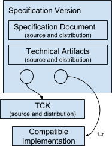
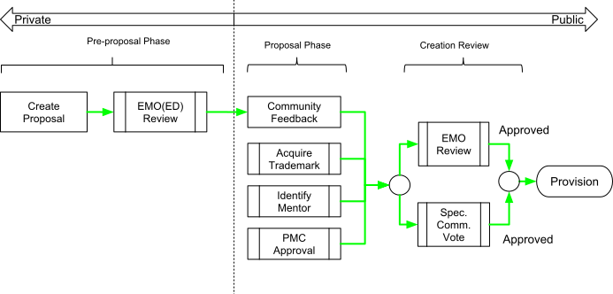
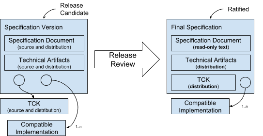

////
 * Copyright (C) Eclipse Foundation, Inc. and others. 
 * 
 * This program and the accompanying materials are made available under the
 * terms of the Eclipse Public License v. 2.0 which is available at
 * http://www.eclipse.org/legal/epl-2.0.
 * 
 * SPDX-License-Identifier: EPL-2.0
////
[[efsp]]
= Eclipse Foundation Specification Process v1.0

Version 1.0. Effective December 7, 2018

The document describes the Eclipse Foundation Specification Process (EFSP) for optional use by Eclipse Foundation Working Groups.

The EFSP leverages and augments the https://www.eclipse.org/projects/dev_process/development_process.php[Eclipse Development Process] (EDP). The EDP defines important concepts, including the Open Source Rules of Engagement, the organizational framework for open source projects and teams, releases, reviews, and more.

Although many of the activities related to this process are conducted by open source projects operating under the EDP, this specification process, and the Specification Versions delivered under it, are to be managed by Working Groups.

Subject to the approval of the Eclipse Management Organization (Executive Director or Delegate), individual Specification Committees may tailor the process for their unique requirements.

This document, and future revisions thereof will be approved by the Eclipse Foundation Board of Directors.

[[efsp-documents]]
== Applicable Documents and Processes

* https://www.eclipse.org/org/documents/eclipse_foundation-bylaws.pdf[Eclipse Foundation Bylaws]
* https://www.eclipse.org/org/workinggroups/industry_wg_process.php#[Working Group Process]
* https://www.eclipse.org/org/workinggroups/IWG_Participation_Agreement.pdf#[Working Group Participation Agreement]
* Eclipse Foundation Specification License
* Eclipse Foundation Technology Compatibility Kit License
* Eclipse Foundation Trademark License Agreement
* https://www.eclipse.org/org/documents/eclipse_membership_agreement.pdf#[Eclipse Foundation Membership Agreement]
* https://www.eclipse.org/projects/dev_process/development_process.php#[Eclipse Development Process]
* https://www.eclipse.org/org/documents/Eclipse_IP_Policy.pdf#[Eclipse Foundation Intellectual Property Policy]
* https://www.eclipse.org/org/documents/Eclipse_Antitrust_Policy.pdf#[Eclipse Foundation Anti-Trust Policy]

In the event of any conflict between the terms set forth in this Eclipse Foundation Specification Process and the terms of the documents listed above, the terms of those documents shall take precedence.

[[efsp-terms]]
== Terms and Definitions

[glossary]
Brand :: The name and logo selected by the Working Group solely for the use of Compatible Implementations of Specifications designated by a Specification Committee.

Check Point Reviews :: The Plan Review, the Progress Review, and the Release Reviews.

Committer :: A developer who has the necessary rights to make decisions regarding a Project.

Compatible Implementation :: Any implementation that fulfills all requirements of a Final Specification as demonstrated by fulfilling all requirements of the associated TCK.

Contribution :: Content delivered to a Project under the terms of the https://www.eclipse.org/legal/ECA.php#[Eclipse Contributor Agreement].

Contributor :: An individual who is a party to the https://www.eclipse.org/legal/ECA.php[Eclipse Contributor Agreement].

Creation Review :: A review to assess the community and membership response to a Project Proposal, verifies that appropriate resources are available for the project to achieve its plan, and serves as a Committer election for the project's initial Committers. For a complete definition, see the https://www.eclipse.org/projects/dev_process/#6_3_1_Creation_Review[EDP].

Final Specification :: A Ratified Specification Version.

Individual Participant :: An individual Committer on a Specification Project.

Member Participant :: A Member of the Eclipse Foundation including Solutions Member, Enterprise Member, or Strategic Member (as defined in the https://www.eclipse.org/org/documents/eclipse_foundation-bylaws.pdf#[Eclipse Foundation Bylaws]) that has one or more Committers on a Specification Project.

Milestone :: A build of the project content for limited distribution to demonstrate progress and solicit feedback.

Open Source License ::
// TODO: Other than by using passthrough HTML, I don't know how to group
// in a glossary entry.
One of the following OSI-approved open source licenses: +++<ol><li><a href="https://www.eclipse.org/legal/epl-2.0/">Eclipse Public License - v 2.0</a> (possibly with Secondary Licenses) SPDX short identifier: EPL-2.0</li><li><a href="https://www.eclipse.org/org/documents/edl-v10.php">Eclipse Distribution License - v 1.0</a> SPDX short identifier: BSD-3-Clause</li><li><a href="https://opensource.org/licenses/Apache-2.0">Apache License - v 2.0</a>. SPDX short identifier: Apache-2.0</li></ol>+++
This list may be modified with the unanimous approval of the Working Group Steering Committee and the Eclipse Foundation Board of Directors.

Participant :: A Member Participant or Individual Participant.

Participant Representative :: The Committer on a Specification Project who has the right to represent the interests (including without limitation the right to vote on behalf of) of a Participant. The Participant Representative of an Individual Participant is the same person.

Plan Review :: A Review to approve a Release Plan to start a Release Cycle.

Pre-Proposal Phase :: A phase in the Project lifecycle during which an individual or group of individuals declares their interest in, and rationale for, establishing a Project and assembles a proposal to create a new Specification Project. For a complete definition, see the https://www.eclipse.org/projects/dev_process/#6_2_1_Pre-Proposal[EDP].

Profile :: A Specification that includes by reference a collection of Specifications and possibly additional requirements.

Progress Review :: A type of Review that is used by a Project Team to summarize the accomplishments of the Project, verify that the Eclipse Development Process and IP Policy have been followed, and to highlight any remaining quality and/or architectural issues. For a complete definition, see the EDP.

Project :: A Project is the main operational unit by which all open source development occurs. For a complete definition, see the https://www.eclipse.org/projects/dev_process/#4_Structure_and_Organization[EDP].

Project Management Committee (PMC) :: The primary leadership of a Top-Level Project with  responsibility to ensure that the Projects within its purview are active and viable. For a complete definition, see the https://www.eclipse.org/projects/dev_process/#4_6_Leaders[EDP].

Project Proposal :: A document that describes the Project and the context in which the Project is being created. For more information, see the https://www.eclipse.org/projects/dev_process/#6_2_2_Proposal[EDP].

Project Leadership Chain :: The leadership chain for a project is composed of the project's project lead(s), the leadership of the parent project (if any), the PMC leads and PMC members for the Top-Level Project, the EMO, and the EMO(ED). For a complete definition, see the https://www.eclipse.org/projects/dev_process/#4_6_Leaders[EDP].

Proposal Phase :: A phase in the Project lifecycle during which a Project Proposal is presented to the community and Membership at Large to solicit feedback. For a complete definition, see the EDP.

Ratified :: A Specification Version that has been adopted by the Specification Committee and made available under the Eclipse Foundation Specification License to enable the creation and certification of Compatible Implementations.

Release Candidate :: A feature-complete Milestone.

Release Cycle :: The cycle of development that produces a Specification Version.

Release Plan :: The description of activities to be undertaken as part of a Release Cycle to produce a Specification Version.

Release Review :: A Release Review is a type of Progress Review that is aligned directly with a specific Release. This definition is the same as in the https://www.eclipse.org/projects/dev_process/#6_3_3_Release_Review[EDP].

Review :: The EFSP uses the same reviews as defined in the https://www.eclipse.org/projects/dev_process/#6_3_Reviews[EDP].

Scope :: The defined scope of activities for a Specification Project.

Service Release :: A release that fixes bugs only. For example, spelling and simple grammar updates that do not change meaning in a Specification Document or API documentation. The PMC and Specification Committee can provide more guidance.

Specification :: A collection of Application Programming Interface (API) definitions, descriptions of semantic behavior, data formats, protocols, and/or other referenced specifications, along with its TCK, intended to enable the development and testing of independent Compatible Implementations.

Specification Committee :: A committee of a Working Group established to manage this Process for technologies within the scope of its Working Group.

Specification Document :: The document that defines a Specification.

Specification Project :: An Eclipse Foundation Project operating under the EDP and EFSP that is constituted to deliver Specification Versions.

Specification Team :: The collective of Committers with responsibilities and privileges on a specific Specification Project.

Specification Version :: A specific version of a Specification.

Super-majority :: Two-thirds of the eligible voters

Top-Level Project :: An organizational unit that defines an overall mission and scope for a collection of Projects (and Specification Projects). For a complete definition, see the EDP.

Technology Compatibility Kit (TCK) :: Software and documented requirements that support the testing of implementations to ensure that they are compatible with the Specification.

Termination of Participation :: Occurs when an Individual Participant or Member Participant removes themselves or the Committers in their employ from a Specification Project.

Working Group :: An Eclipse Foundation Working Group established under the https://www.eclipse.org/org/workinggroups/industry_wg_process.php[Eclipse Industry Working Group Process]. Definitions from the Working Group Process are included herein by reference.

Other terms used in this document are defined in the https://www.eclipse.org/projects/dev_process[EDP].

[[efsp-structure]]
== Structure and Organization

A Specification Project is the main operational unit for Specification development at the Eclipse Foundation.

[[efsp-projects]]
=== Specification Projects

Specification Projects operate under the supervision of both the Project Leadership Chain and the Specification Committee.

Among other things, the Scope of a Specification Project is intended to inform companies and individuals so they can determine whether or not to contribute to the Specification. Since a change in Scope may change the nature of the contribution to the project, a change to a Specification Project’s Scope must be approved by a Super-majority vote of the Specification Committee.

[[efsp-specifications]]
=== Specifications

Specifications must be developed by Specification Projects. 

A Specification may describe parts as being optional. Optional parts of a Specification must not conflict with one another; it must be possible for a Compatible Implementation to implement all optional parts.

A Specification can define rules. If defined, such rules must not override the rules defined in any referenced Specification.

A Specification that aggregates other Specifications by reference may be designated as a Profile. Profiles do not have to be arranged in unique subsets (i.e. a Specification may appear in more than one Profile). A Super-majority, including a Super-majority of Strategic Members, is required to approve a Profile Specification. A Specification Committee may, at its discretion, elect to label one or more Profiles as a “Platform”.

[[efsp-versions]]
==== Specification Versions

Each Specification Version references specific versions of its constituent artifacts. These artifacts include the Specification Documents, zero or more other Specifications, one or more Compatible Implementations licensed under an Open Source License, and exactly one associated TCK for this Specification.

.Conceptual structure of a Specification Version

The Specification Document and related technical artifacts must be developed by the Specification Team.

[[efsp-tck]]
==== Technology Compatibility Kits

There is exactly one TCK project under an Open Source License for each Specification Version.

A specific version of a TCK is chosen by the Specification Project for each Specification Version; the TCK may be different for different Specification Versions.

Any implementation that fulfills all of the requirements of the TCK associated with a Final Specification may claim that it is a Compatible Implementation of that Final Specification. The TCK version associated with the Final Specification must not be modified other than as allowed or required by the rules of the TCK.

All parts of a Specification, including optional parts, should be covered by the TCK.

[[efsp-compatible]]
==== Compatible Implementations

A Compatible Implementation must fully implement all non-optional elements of a Specification Version, must not extend the API (no supersetting), and must fulfill all the requirements of the corresponding TCK. A Specification Version must identify at least one Compatible Implementation under an Open Source License that implements all optional elements of the Specification and fulfills the requirements of all elements (including optional elements) of the TCK.

[[efsp-committers]]
=== Committers

Specification Project Committers must be Members of the Eclipse Foundation. Committers may be Members by virtue of working for a member organization, or may choose to complete the membership process independently.

All Specification Project Committers must be covered by a Working Group Participation Agreement.

Member Participants have the right to appoint a Participant Representative to every Specification Project that falls under the purview of the Specification Committee.

[[efsp-committee]]
=== Specification Committee

The Specification Committee works with the PMC to manage the overall vision for the Specification Projects under their supervision.

[[efsp-committee-approvals]]
==== Approvals

A Specification Committee must approve, by Super-majority, the following lifecycle events of Specification Projects:

* The creation of a new Specification Project.
* The Release Plan for a new Release Cycle of a Specification.
* Each revision to the Scope of a Specification.
* Each Review of a Specification Project, including the adoption of Specification Versions.
* A Profile Specification (this Super-majority must include a Super-majority of Strategic Members).
* A Platform designation (this Super-majority must include a Super-majority of Strategic Members).
* Service Releases.

[[efsp-plans]]
=== Release Plans

A Release Plan lists themes and areas of focus, describes Milestones, and lists tentative dates for Reviews. The work defined by a Release Plan must be within the Scope of the Specification Project.

The exact requirements for a Release Plan, including the number and timing of Milestones and Reviews, are determined by the Project Leadership Chain and the Specification Committee. Minimally, a Release Plan must include a textual description of the activities planned for the Specification Version, and tentative dates for at least one Milestone, at least one Progress Review, and the Release Review. Following approval, the Specification Committee must be notified of any changes to the dates of the Progress Review and the Release Review. The Specification committee can require that the project team engage in a Progress Review.

The Project Proposal serves as the Release Plan for the first release of a Specification Project.

A Release Plan must be approved by a Super-majority vote of the Specification Committee. If the Release Plan is rejected, the Specification Team may reapply at a future date.

[[efsp-process]]
== Specification Process

The EFSP is based on the Development Process described in the https://www.eclipse.org/projects/dev_process/#6_Development_Process[EDP].

[[efsp-project-lifecycle]]
=== Specification Project Lifecycle

The Specification https://www.eclipse.org/projects/dev_process/#6_2_Project_Lifecycle[Project Lifecycle] is defined by the EDP.

[[efsp-version-lifecycle]]
=== Specification Version Lifecycle

To produce a Specification Version, a Specification Project must engage in a formal Release Cycle under supervision of the Project Management Committee (PMC) and the Specification Committee.

.The Specification Version Lifecycle at a high-level
[graphviz, images/lifecycle, svg]
.An overview of the Project Creation Process
----
include::diagrams/efsp_lifecycle.dot[]
----

A Specification Project’s first Release Cycle starts with the successful completion of a Creation Review. To start a subsequent Release Cycle, the Specification Team presents a Release Plan to the Specification Committee in a Plan Review. The Plan Review must be approved by a Super-majority vote of the Specification Committee.

The Specification Team must deliver at least one Milestone to demonstrate progress and solicit feedback. Milestones may be incomplete. For example, designated Compatible Implementations will not necessarily pass milestone builds of the TCK in their entirety. Subsequent Milestones should, however, demonstrate progress. Later Milestones may be referred to as Release Candidates.

Milestones should be staged for limited distribution to key stakeholders to solicit feedback. The delivery of at least one Milestone must coincide with engagement in a successful Progress Review.

The Specification Team must engage in a successful Release Review before the final Specification Version may be Ratified. A Specification Version becomes a Final Specification when it is Ratified.

Service Releases (bug fixes) for a Specification Version that has engaged in a successful Release Review do not require any further Reviews, but must be approved by a Super-majority vote of the Specification Committee.

[[efsp-reviews]]
=== Reviews

Reviews are a formal process through which all major lifecycle events and changes to Specification Projects are announced and reviewed by the membership-at-large, and approved by the PMC, the Specification Committee, and the EMO.

A Specification Project may engage in all of the Reviews described by the EDP with the additional requirement that approval by a Super-majority vote of the Specification Committee is required to successfully complete a Review. Such Review shall include affirmation that the Specification Version in progress remains within the Scope of the Specification Project. Other additions and qualifications are noted in the descriptions of the reviews below.

Project Leads are responsible for initiating the appropriate Reviews. The Project Leadership Chain may also initiate a Review on the project’s behalf.

The Specification Team must complete all required due diligence under the Eclipse IP Policy before initiating a Review.

[[efsp-reviews-creation]]
==== Creation Review

Specification Projects are created using the process defined by the EDP with the added requirement that the Specification Committee must approve the Project Proposal by a Super-majority before the Specification Project can successfully complete a Creation Review.

.The Specification Project creation process.

The Specification Committee vote and the Creation Review run in parallel for a minimum of one week. The Project Proposal text must not be changed during the Creation Review period. If changes are required during this period, the Project Proposal is pushed back into the Proposal Phase.

[[efsp-reviews-plan]]
==== Plan Review

A Plan Review provides a means for the Specification Team to present their Release Plan to the Project Leadership Chain, the Specification Committee, and the community for feedback. The Specification Committee must approve the Plan Review by a Super-majority vote.

[[efsp-reviews-progress]]
==== Progress Review

A Specification Project must engage in at least one successful Progress Review during every release cycle. The timing of a Progress Review must coincide with the staging of a Milestone which must be delivered to the PMC and the Specification Committee before the start of the Review.

The Specification Committee must approve the Progress Review by a Super-majority vote.

Progress Reviews may be combined with a Graduation or Restructuring Review, but must not be combined with a Release Review.

[[efsp-reviews-release]]
==== Release Review

A Specification Project must engage in a successful Release Review at the end of each Release Cycle.

The final build of the Specification Version’s artifacts must be delivered to the PMC and Specification Committee before the start of the Release Review. The final build may be staged before the start of the review, but must not be distributed as an official release until the Release Review is successfully completed.

The Specification Team must provide evidence that the TCK selected for the Specification Version provides sufficient coverage to reasonably validate Compatible Implementations.

The Specification Team must provide evidence that cited Compatible Implementations fulfill all requirements of the TCK and that at least one Compatible Implementation implements all optional aspects.

A Release Review concludes successfully with approval from the PMC and EMO, and approval by a Super-majority vote of the Specification Committee.

With approval, the Specification Project must release the final build of the artifacts of the Specification Version.

[[efsp-ratification]]
=== Ratification

With the successful completion of a Release Review, including approval of the Specification Committee by a Super-majority vote, a Specification Version is Ratified and the associated artifacts can be promoted and distributed by the Specification Committee as a Final Specification.

All Specification Versions referenced by a Ratified Final Specification must themselves be Ratified. The Release Review for prerequisite Specification Versions may be run concurrently with the Release Review for a referenced Specification Version.

The Specification Document for the Final Specification must be distributed as read-only text under the Eclipse Foundation Specification License. The Ratified TCK in composite must be distributed under the Eclipse Foundation Technology Compatibility Kit License. Other technical artifacts must be distributed under an Open Source License.

The diagram below is a conceptual model of the transition from a Specification Version to a Final Specification. No specific packaging technology or structure should be implied from this diagram.

.Conceptual model of the transition from a Specification Version to a Final Specification. Note that no specific packaging technology or structure should be implied from this diagram.

